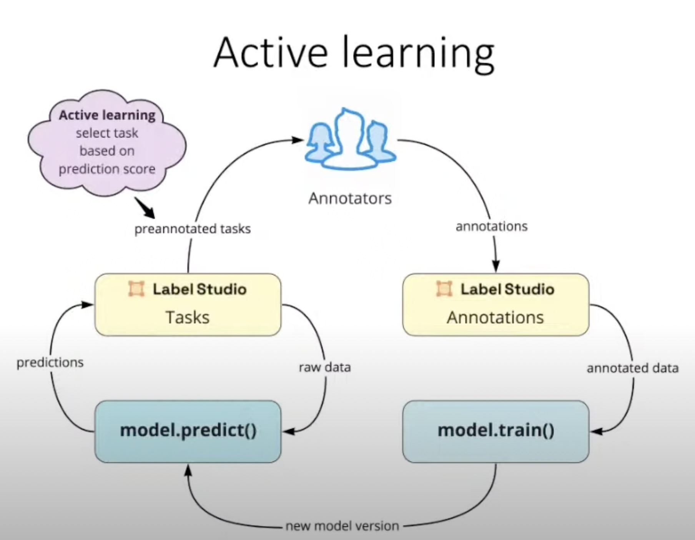
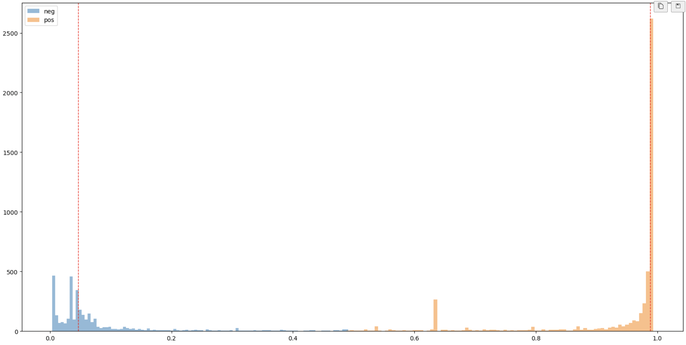

# Phân tích sắc thái đánh giá các mặt hàng trên Shopee

Đối với các đối tượng bán hàng, hay các trung gian thì việc đảm bảo sự thoả mãn của khách hàng dựa trên dịch vụ hay chất lượng sản phẩm là điều hiển nhiên. Bất kể sản phẩm nào được bán trên Shopee, họ đều đảm bảo mang lại trải nghiệm tốt nhất cho người dùng từ khâu tìm kiếm sản phẩm đến quá trình vận chuyển sản phẩm, bao gồm cả quy cách đóng gói sản phẩm và chất lượng sản phẩm. Sau khi sản phẩm được giao, Shopee luôn khuyến khích khách hàng của mình xếp hạng sản phẩm và viết trải nghiệm tổng thể của họ trên trang của sản phẩm như một chiến dịch thương mại, từ đó thu được ý kiến và cải thiện.

Đánh giá và nhận xét do người mua cho một sản phẩm là một thông tin quan trọng đối với đối tác điện tử lớn như Shopee. Những đánh giá sản phẩm này giúp người bán hiểu nhu cầu của khách hàng và nhanh chóng điều chỉnh các dịch vụ của mình để mang lại trải nghiệm tốt hơn cho khách hàng trong đơn hàng tiếp theo. Nhận xét của người dùng cho một sản phẩm bao gồm các khía cạnh như dịch vụ giao hàng, đóng gói sản phẩm, chất lượng sản phẩm, thông số sản phẩm, phương thức thanh toán, v.v. Vì vậy một hệ thống chính xác để hiểu những đánh giá này có tác động lớn đến toàn bộ Shopee trải nghiệm người dùng.

## Mục tiêu 
Mục tiêu của repo này bao gồm  
1. Thu thập dữ liệu từ sàn thương mại điện tử Shopee 
2. Xử lí dữ liệu và gán nhãn ở mức độ câu (sentence-level)
3. Huấn luyện mô hình phân tích sắc thái đánh giá sản phẩm trên Shopee bằng PhoBert 
4. Đánh giá độ chính xác dựa trên các metrics accuracy, precision, recall, và F1-score

## Thu thập dữ liệu

Để lưu trữ và sử dụng cho các mục đích sau, toàn bộ các thuộc tính cần thiết sẽ được lưu lại dưới định dạng bảng như id người dùng, id của shop và id sản phẩm cùng với comment đánh giá. Ngoài ra các meta data được thu thập thêm cho việc hậu xử lí hay các tác vụ có thể trong tương lai bao gồm đánh giá trung bình các mặt hàng của shop đối tượng, đánh giá của comment, đánh giá trung bình của các comment khác hay số lượng bán. Cụ thể dữ liệu được sao lưu về có định dạng là một file csv với các thuộc tính như sau **userid, shopid, itemid, cmtid, mtime, rating\_star, comment, product\_name, shop\_name, shop\_rating, avg\_rating, rating\_count, sold**. Repo [này](https://github.com/nhtlongcs/shopee-reviews-crawler/) của tôi đã được cài đặt để làm công việc này. 

## Tiền xử lý dữ liệu

Đối với dữ liệu thô, ta sẽ lần lượt làm sạch, chuẩn hoá và gán nhãn. Ở dữ liệu lấy xuất hiện hiện tượng các từ bị dính liền nhau. Vậy để tách các cụm từ (không có dấu phân cách) bằng cách tìm danh sách các từ có thứ tự trong từ điển để sau khi ghép tất cả các từ, kết quả phù hợp với cụm từ ban đầu. Điều này có thể được tối ưu bằng chiến lược quy hoạch động, mã nguồn có thể truy cập ở [đây](https://github.com/nhtlongcs/convert-to-word-level). Sau khi xoá bỏ dữ liệu trùng lắp, các dữ liệu hữu ích và chứa thông tin chỉ bao gồm hơn 8000 mẫu dữ liệu, trong đó có hơn 3000 mẫu là negative là 5000 mẫu là positive.

## Gán nhãn và quy trình gán nhãn

<!-- insert image asset/active.png -->

Con người là phần quan trọng nhất của bất kỳ quy trình làm việc nào. Họ là những người cung cấp kiến thức và chuyên môn cần thiết để hoàn thành một tác vụ. Nếu không có đầu vào của con người, dữ liệu chắc chắc không thể học được bởi các mô hình với hiệu năng hiện nay. Chính điều này khiến họ trở thành tài sản vô giá trong bất kỳ môi trường làm việc nào. Human in the loop là quy trình mà con người tham gia vào đánh nhãn cùng với sự hỗ trợ của mô hình trên các gợi ý có sẵn, chọn ra đối tượng có độ tin cậy không cao và chỉnh sửa. Quy trình cho phép người sỡ hữu dữ liệu có nhiều quyền kiểm soát hơn đối với dữ liệu của mình và cải thiện chất lượng nhãn.

*Đảm bảo chất lượng dữ liệu*. Khi sử dụng phương pháp này, có thể tự mình kiểm tra từng phiên bản và đảm bảo rằng phiên bản đó đáp ứng các tiêu chuẩn. Bằng cách này, bạn có thể yên tâm rằng tập dữ liệu của mình có chất lượng tốt và sẽ hữu ích cho việc đào tạo các mô hình máy học.

*Tăng tốc thời gian gán nhãn*. Phương pháp này tiết kiệm thời gian vì ta có thể sử dụng, kế thừa các mô hình sẵn có cho tác vụ của bản thân để giảm thời gian gán nhãn. 

*Giảm chi phí*. Khi sử dụng phương pháp này, có thể giảm chi phí cho việc gán nhãn bằng cách sử dụng các mô hình sẵn có.

Cụ thể, chiến lược gán nhãn có thể thấy ở hình trên, 2 vùng nhãn khác nhau mang 2 màu khác nhau và tập trung về 2 đầu của khoảng 0-1. Từ đó ta sử dụng dynamic threshold dựa trên phân phối của 2 loại dữ liệu để chọn ra các kết quả có độ tin cậy thấp để đẩy vào bước gán nhãn. Ta lặp lại việc này đến khi tạo được dữ liệu vừa ý.

## Mô hình và kết quả 

Ở phần này, tôi sẽ không đi quá sâu về kiến trúc mô hình. Mục tiêu chính của repo là thực hiện toàn bộ quy trình khi tiếp cận một bài toán mới, bao gồm thu thâp - gán nhãn - huấn luyện - đánh giá. Tôi sử dụng thư viện [Hugging Face](https://huggingface.co/) dựa trên PyTorch để xây dựng mô hình. Mô hình PhoBert được huấn luyện trên tập dữ liệu tiếng việt là sự lựa chọn của tôi. Kết quả thực nghiệm có thể thấy ở hình dưới đây

