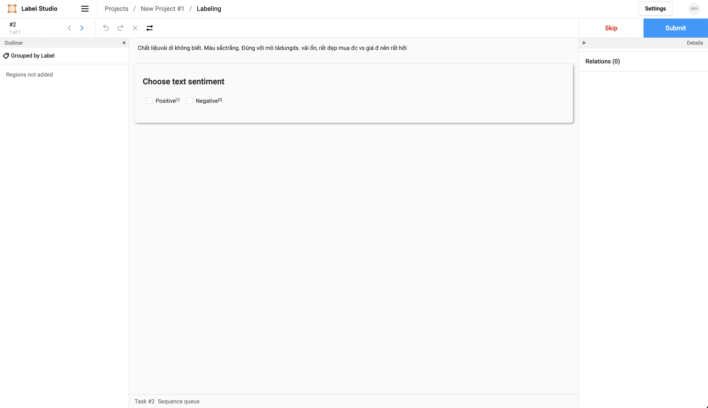

For manually labelling the data, we will be using the [Label Studio](). As beggining, we need to install the Label Studio first. We can install it by using docker. 
```
docker pull heartexlabs/label-studio:latest
docker run -it -p 8080:8080 -v (pwd)/mydata:/label-studio/data heartexlabs/label-studio:latest
```

After that, we can access the Label Studio by using the link http://localhost:8080. We can see the Label Studio interface as below.

